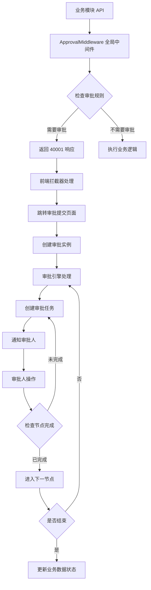

## 产品概述

在现有 AIPanelAdmin 系统中新增审批模块，采用插件化架构，支持通用审批和可配置的业务审批流程。通过全局中间件拦截需要审批的业务操作，无需在各业务模块中手动添加装饰器。

## 核心功能

- **审批流程配置**：支持创建、编辑、启用/禁用审批流程，配置审批节点、审批人、审批类型
- **全局审批拦截**：通过中间件自动拦截配置了审批规则的业务操作（POST/PUT/DELETE），返回提示引导用户提交审批
- **多级审批引擎**：支持单级审批、多级顺序审批、条件审批（根据表单数据走不同分支）、会签（所有人通过）/或签（任一人通过）
- **通用审批表单**：支持 JSON 配置动态表单，可适配不同业务场景的审批需求
- **审批中心**：用户查看待办审批、已办审批、发起审批的统一的界面
- **审批流程可视化**：图形化展示审批进度和审批历史记录
- **业务模块集成**：与采购、财务、销售等现有模块通过审批规则配置表动态集成

## 技术栈

- 后端：FastAPI + Tortoise ORM（与项目现有栈一致）
- 前端：Vue 3 + Element Plus（与项目现有栈一致）
- 数据库：PostgreSQL（通过 Tortoise ORM）
- 审批引擎：自研状态机引擎，基于数据库存储流程定义

## 实现方案

### 系统架构



### 数据模型设计

在 `base/plugins/approval/models/` 下创建以下模型：

1. **ApprovalFlow**（审批流程定义）

- id, name, code, description, is_active, form_config(JSON), flow_config(JSON), business_type, is_system, created_at, updated_at

2. **ApprovalNode**（审批节点定义，存储于 flow_config 中，不单独建表）

3. **ApprovalInstance**（审批实例）

- id, flow_id, business_type, business_id, business_data(JSON), title, applicant_id, status, current_node, form_data(JSON), result, complete_time, created_at, updated_at

4. **ApprovalTask**（审批任务）

- id, instance_id, node_id, approver_id, status, comment, approve_time, transfer_to, created_at, updated_at

5. **ApprovalRecord**（审批操作记录）

- id, instance_id, task_id, node_id, operator_id, action, comment, before_status, after_status, created_at

6. 审批规则已合并进流程（ApprovalFlow）

- 业务模型匹配（model / action / methods / priority）直接作为 `approval_flow` 表的字段，流程本身即审批规则，不再单独维护 approval_rule 表。
- ApprovalFlow 新增字段：model（业务模型标识）、action（执行动作 create/update/delete，NULL 表示匹配全部）、methods（拦截 HTTP 方法 JSON）、priority（优先级，越大越高）。

### 审批门禁实现

审批判定下沉到 Service 层，由 `base/plugins/approval/services/approval_gate.py` 的 `gate_write` 触发（BaseBusinessService 的写操作自动调用）：

- 根据业务模型（model）与 HTTP 方法（method）查询 `approval_flow` 表
- 仅匹配启用流程；method 需在流程 methods 列表；流程指定了 action 时仅匹配该动作；同一 model+action 命中多条流程按 priority 取最高
- 如果匹配到流程，自动创建审批实例并抛 `NeedApprovalError`，由全局异常处理器返回 JSON：`{"code": 40001, "msg": "该操作需要审批", "require_approval": true, "flow_id": 1, "flow_name": "采购审批"}`
- 前端 response 拦截器捕获该响应，引导用户提交审批

### 审批引擎核心逻辑

- 使用状态机模式管理审批流程
- 支持节点类型：start（开始）、approve（审批）、condition（条件）、fork（分支）、join（汇聚）、end（结束）
- 会签逻辑：节点所有任务都 approve 才进入下一节点
- 或签逻辑：任一任务 approve 即进入下一节点
- 条件节点：根据 form_data 中的字段值匹配条件分支

### 目录结构

```
base/plugins/approval/
├── manifest.json
├── plugin.py
├── models/
│   ├── __init__.py
│   ├── approval_flow.py
│   ├── approval_instance.py
│   ├── approval_task.py
│   └── approval_record.py
├── schemas/
│   ├── __init__.py
│   ├── flow_schema.py
│   ├── instance_schema.py
│   └── task_schema.py
├── services/
│   ├── __init__.py
│   ├── flow_service.py
│   ├── instance_service.py
│   ├── task_service.py
│   ├── record_service.py
│   └── approval_engine.py
├── api/v1/
│   ├── __init__.py
│   ├── flow_router.py
│   ├── instance_router.py
│   ├── task_router.py
│   └── rule_router.py
└── middleware/
    ├── __init__.py
    └── approval_middleware.py

web/src/views/approval/
├── Index.vue
├── FlowConfig.vue
├── InstanceDetail.vue
├── MyTasks.vue
└── components/
    ├── ApprovalProgress.vue
    ├── FlowGraph.vue
    └── FormRenderer.vue
```

## 实施要点

1. **门禁优先级**：审批门禁在 BaseBusinessService 写操作中主动调用，命中即创建实例并抛 NeedApprovalError
2. **性能优化**：按模型匹配的流程查询结果走 model 索引，命中流程数小，无需缓存；插件扫描结果已缓存
3. **前端集成**：修改 `web/src/utils/request.js` 的响应拦截器，处理 code=40001 的情况
4. **审批与业务解耦**：业务数据只存储审批实例 ID 和状态，不直接依赖审批模块的数据结构
5. **向后兼容**：未配置流程规则的业务操作保持原有行为不变

## 设计风格

采用与现有系统一致的 Element Plus 企业级设计风格，保持界面风格统一。审批模块作为独立的菜单模块，包含审批中心、流程规则、我的待办等功能页面。

## 页面规划

### 1. 审批中心页面（Index.vue）

- 顶部统计卡片：待办数量、已办数量、发起数量、抄送数量
- Tab 切换：待我审批、我已审批、我发起的、抄送我的
- 列表展示：标题、发起时间、当前节点、状态
- 操作按钮：审批、查看详情、撤销

### 2. 发起审批页面

- 选择审批类型（从启用的流程定义中选择）
- 动态表单渲染（根据流程配置的 form_config）
- 附件上传功能
- 提交按钮

### 3. 审批详情页面（InstanceDetail.vue）

- 审批表单数据展示
- 审批进度可视化（步骤条 + 时间线）
- 审批操作区：通过、拒绝、转审、加签
- 审批历史记录

### 4. 流程配置页面（FlowConfig.vue）

- 流程列表（表格）
- 流程设计器（简单的节点配置表单，不依赖第三方库）
- 启用/禁用开关

### 5. 审批规则配置页面

- 规则列表
- 配置业务路径与审批流程的映射关系

## 交互设计

- 审批操作使用对话框形式，支持填写审批意见
- 审批进度使用步骤条 + 时间线组合展示
- 待办数量在菜单上显示角标
- 审批通知通过系统消息推送